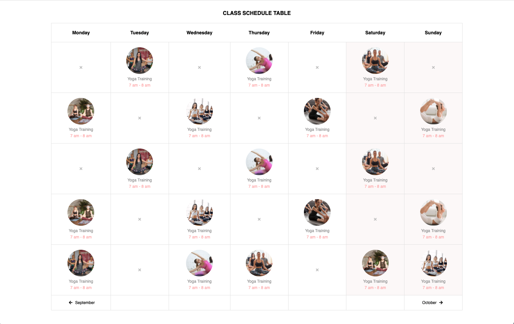

# Basic Data Exercises

## Class Schedule Table

**Instructions**:

1. Create a basic HTML page with all important elements.
2. Look at the mockup file and create the table.
3. Use font awesome icons (x: times, arrow-right,  arrow-left)

- For online version just [click...!](https://hsnakk.github.io/schedule-table/)